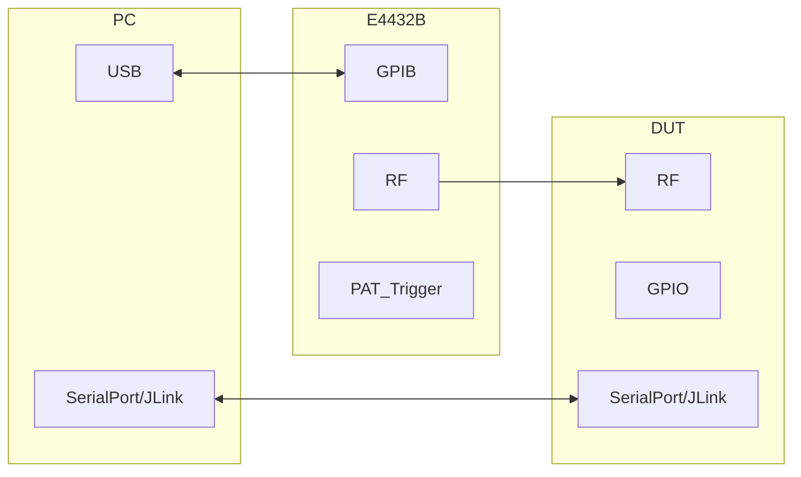

```mermaid
graph LR
    subgraph PC
    GPIB_PC[USB]
    SerialPort/JLink_PC[SerialPort/JLink]
    end

    subgraph DUT    
    RF_DUT[RF]
    Trigger_DUT[GPIO]
    SerialPort/JLink_DUT[SerialPort/JLink]
    end    

    subgraph E4432B
    GPIB_SG[GPIB]
    RF_SG[RF]
    PAT_SG[PAT_Trigger]
    end

    GPIB_PC <--> GPIB_SG
    RF_SG --> RF_DUT
    SerialPort/JLink_PC <--> SerialPort/JLink_DUT

```

Trigger_DUT --> PAT_SG