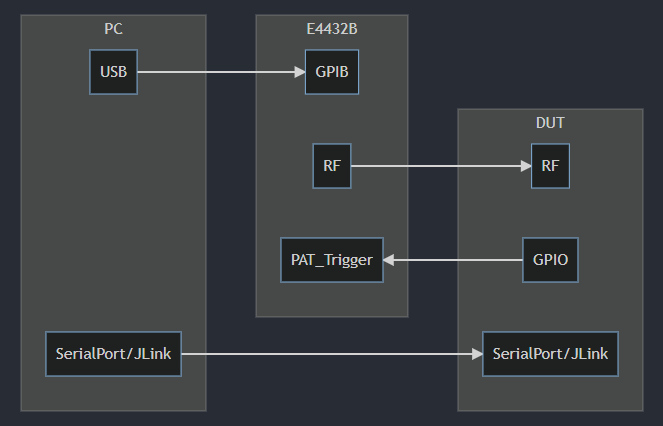
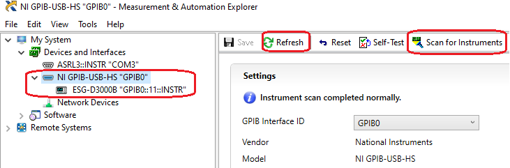
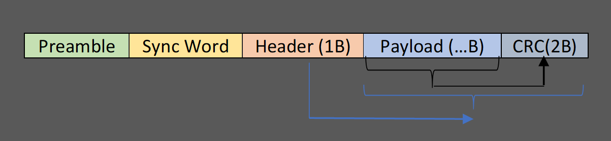
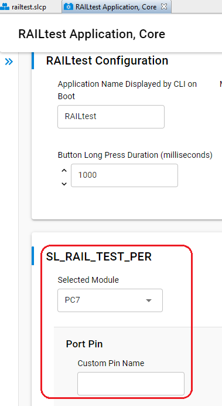

# How to Test Sensitivity of Long Range DSSS PHY on E4432B

## Overview
This article introduces the approach of testing the sensitivity of Silicon Labs Long Range PHY on Agilent E4432B, including the tool of generating the ARB waveform, the steps of setting the E4432B and how to do the PER test.


## Hardware Required
- Signal Generator E4432B
- IEEE 488.2 GPIB to USB cable (One of the following).
  - [Agilent 82357B USB/GPIB Interface](https://www.keysight.com/hk/en/product/82357B/usb-gpib-interface-high-speed-usb-2-0.html)
  - [NI GPIB-USB-HS](https://www.ni.com/zh-cn/support/model.gpib-usb-hs.html)
- PC
- DUT

## Software Required
- IEEE 488.2 GPIB Driver (Install the driver according to your GPIB card provider).
  - [Agilent 82357B USB/GPIB Driver](https://www.keysight.com/hk/en/support/82357B/usb-gpib-interface-high-speed-usb-2-0.html#drivers)
  - [NI GPIB-USB-HS Driver](https://www.ni.com/zh-cn/support/downloads/drivers/download.ni-488-2.html#409630)
- [Silabs_LR_WaveformGenerator.exe](releases/download/v1.2/Silabs_LR_WaveformGenerator.exe)

## Connection
<div align="center">
    
</div>  
</br> 

**Notes:**  

Please use the GPIB driver to verify the GPIB connection. Assuming you are using the NI GPIB-USB-HS card, you can start the program **NI Max** to verify it.
<div align="center">
      
</div>  
</br>


## How It Works
### Generate Waveform
1. Start the tool [Silabs_LR_WaveformGenerator.exe](releases/download/v1.2/Silabs_LR_WaveformGenerator.exe).
2. Fill the payload which you want test. The header and CRC of the frame will be automatically updated. The long range PHY uses IEEE802.15.4 frame format, like below:

    <div align="center">
          
    </div>  
    </br>
    
    **Note**: The byte order in the GUI of the tool is the same with the byte order of the packet over the air.

3. Fill the waveform file name. This is the waveform file name stored on the signal generator.
4. Press the button “Generate” to generate the IQ data.
   
    <div align="center">
          
    </div>  
    </br>   

5. Click the button **Scan** to scan the connected E4432B, then click the **Download** button to download the generated waveform to the instrument. It takes about 30~40 seconds to complete.


### Settings of E4432B
1. On the signal generator keypad, press the **Mode** button and then select **Arb Waveform Generator | Dual Arb**.
2. Choose **Select Waveform**. If the ARB waveform list is empty, choose **Waveform Segments**.
3. Select **Load**, then use the wheel to navigate to the waveform file `LR_9K6`, then select **Load Segment From NVARB Memory**.
4. Press **Return**, navigate to the waveform file, then choose **Select Waveform**.
5. Press **Return**.
6. Select **Arb Setup**, and under **Arb Sample Clock**, input the sample clock with the keypad and then **Enter**. Press the **Return** button.
   Here is how to calculate the sample clock. In the IQ waveform, each bit is represented by 16 points. The sample clock should be:

   `sample clock = data rate * spread factor * 16 / 2` 

   For example, for `Long Range PHY DSSS 9.6kbps`, the spread factor is `8`, then the `sample clock` should be set to:

   `sample clock = 9.6 * 8 * 16 / 2 = 614.4 KHz`

   Here:
   - The number 9.6 is the data rate. The supported data rate includes:
     - `1.2`
     - `2.4`
     - `4.8`
     - `9.6`
     - `19.2`
     - `80`
   - The number `16` in the equation means the IQ points for each bit. It's fixed in the tool.
   - As we will split the data into I and Q, then we will divide the result with `2`.

   Below is a the `sample clock` for the LongRange PHYs with different data rate.

    Data Rate | Sample Clock
    ---------|----------
    1.2 kbps | 76.8 kHz
    2.4 kbps | 153.6 kHz
    4.8 kbps | 307.2 kHz
    9.2 kbps | 614.4 kHz
    19.2 kbps | 1228.8 kHz

7. Set the following:
   - `Arb Reference` -> `Int`
   - `Recon Filter` -> `8 MHz`
   - `Marker Pol` -> `Neg`
   - `Mkr2 to RF Blank` -> `On`

8. Press **Return** button.
9. Select `Trigger` -> `Single`.
10. Select **Trigger Set-up** and set the following:
- `Trigger Source` -> `Ext`
- `Ext Pol` -> `Neg`
- `Ext Delay` -> `Off`
11. Verify that the displayed menu in the middle of the screen shows the following before continuing:
    - Sample Clock 614.4 KHZ
    - Reconstruction 8 MHz
    - Ref Freq 10 MHz (Int)
    - Trig Type Single
    - Trig Source Ext
    - Polarity Neg
    - Retrigger Off
    - Delay Off
11. Turn **Arb** to On.

### Test
Please refer to section `4.2.3` of [AN972](https://www.silabs.com/documents/public/application-notes/an972-efr32-rf-eval-guide.pdf) to learn the testing steps.

The general steps are:  
1. Flash a RAILTEST program to the DUT.
2. On the console of the DUT, run the following command to stop the receiving state.
   ```
   rx 0
   ```
3. On the console of the DUT, run the following command to start PER test.
   ```
   perrx 1000 10000
   ```
   The first argument `1000` means to test 1000 packets.  
   The second argument `10000` means to delay 10000 us between each packets.
4. Use command `perstatus` or `status` to check the status.
5. Adjust the transmitting power of the E4432B and then repeat step 3/4 until the PER reaches the tolerance.

## Test Report
We have made a test based on the board `EFR32FG14 2400/490 MHz 19 dBm Radio Board with TCXO (SLWRB4261A)`. The test is done in a **shielded room**. The test result is like below.

### Test Result of Long Range DSSS 1.2 kbps PHY

SG Tx Power | SG Tx Count | DUT Rx Count
---------|----------|---------
 -129.0 | 1000 | 1000
 -130.0 | 1000 | 934
 -129.2 | 1000 | 985
 -129.2 | 5000 | 4972
 -129.3 | 5000 | 4957
 -129.4 | 5000 | 4955

 **Conclusion**: With PER tolerance set to 1%, the sensitivity is **-129.4 dbm**.

### Test Result of Long Range DSSS 9.6 kbps PHY

SG Tx Power | SG Tx Count | DUT Rx Count
---------|----------|---------
 -130.0 | 1000 | 0
 -120.0 | 1000 | 997
 -125.0 | 1000 | 32
 -122.5 | 1000 | 781
 -121.3 | 1000 | 977
 -120.7 | 1000 | 986
 -120.4 | 1000 | 997
 -120.5 | 1000 | 991
 -120.6 | 1000 | 989
 -120.5 | 5000 | 4970

 **Conclusion**: With PER tolerance set to 1%, the sensitivity is **-120.5 dbm**.

## FAQ
### How to configure the trigger pin in RAILTEST?
On Simplicity Studio V5, open the `.slcp` file of the RAILTEST project, open the configuration of the component `RAILtest Application, Core`, you can select a GPIO as the trigger.
<div align="center">
      
</div>  
</br>


